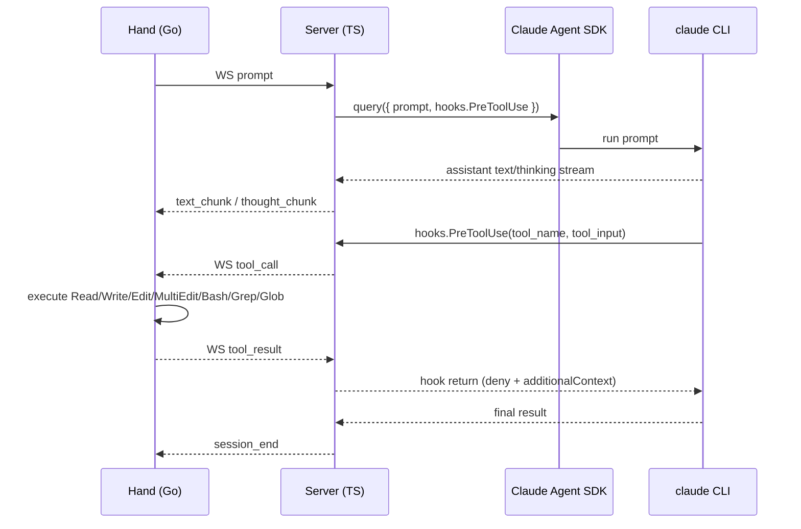

# Axon

Claude Code 的分体式架构：用户在 Hand 端交互，Hand 在本地执行工具，Server 端负责调用 Claude Agent SDK 进行推理，并通过 WebSocket 将工具调用转发回 Hand。

Split architecture for Claude Code: users interact on Hand, Hand executes tools locally, and the Server uses the Claude Agent SDK for reasoning while forwarding tool calls back to Hand over WebSocket.

## 架构总览 / Architecture Overview

```mermaid
flowchart LR
    H1[Hand CLI / Go<br/>用户交互 + 工具执行]
    HN[Hand N / Future]
    S[Axon Server / TypeScript<br/>query() + hooks.PreToolUse]
    C[Claude Code CLI<br/>spawned by SDK]
    G[Go Server Fallback<br/>internal/server]

    H1 <-->|WebSocket| S
    HN -. optional .-> S
    S -->|SDK query stream| C
    S -. fallback path .-> G
```

当前主路径是：

The primary path today is:

```text
Hand (Go) ←→ WebSocket ←→ Server (TypeScript) ←→ Claude Agent SDK query() ←→ claude CLI
```

## 概念 / Concepts

- **Hand 端 / Hand**：用户交互入口，也是 Claude 原生工具的执行环境。当前实现为 Go CLI，支持 `Read`、`Write`、`Edit`、`MultiEdit`、`Bash`、`Grep`、`Glob`。
- **Server 端 / Server**：Brain 端，位于 [`server/src`](./server/src)。使用 `@anthropic-ai/claude-agent-sdk` 的 `query()` 驱动 Claude Code，并通过 `hooks.PreToolUse` 在进程内拦截工具调用。
- **通信 / Transport**：Server 与 Hand 之间通过 WebSocket 全双工通信，文本流和工具调用共用一条连接。
- **Fallback / 备用路径**：[`internal/server`](./internal/server) 中保留 Go Server 作为 fallback 实现，用于兼容旧方案和历史验证。
- **Proxy / Hook 脚本**：[`proxy/`](./proxy) 中的 Axon relay 模式已实现，但在选项 C 下不是主路径；主路径不依赖 HTTP hookbridge、`dispatch.sh` relay 或 `settings.local.json` 注入。

## 核心时序 / Core Sequence



关键点：

Key points:

- **SDK 直接集成 / Direct SDK integration**：不再通过 ACP bridge 把工具调用转换成 client-side methods，而是直接使用 `query()` 和 `hooks.PreToolUse`。
- **进程内 Hook / In-process hooks**：工具拦截发生在 TypeScript Server 进程内，不需要额外的 HTTP bridge。
- **Hand 执行 Claude 原生工具 / Hand executes Claude-native tools**：Hand 按 Claude 工具语义执行本地操作，而不是 ACP 方法名。

## 项目结构 / Project Structure

```text
axon/
├── server/
│   ├── package.json              # TypeScript Server 依赖与启动脚本
│   └── src/
│       ├── index.ts              # Server 入口
│       ├── server.ts             # HTTP + WebSocket Server
│       ├── session.ts            # query() + hooks.PreToolUse 会话驱动
│       ├── relay.ts              # 工具调用 pending/result 管理
│       └── protocol.ts           # TS 版 Hand ↔ Server 协议
├── cmd/
│   ├── hand/main.go              # Hand CLI 入口
│   └── server/main.go            # Go Server fallback 入口
├── internal/
│   ├── hand/
│   │   ├── client.go             # WebSocket 客户端
│   │   ├── executor.go           # 工具分发
│   │   ├── tools_fs.go           # Read / Write / Edit / MultiEdit
│   │   ├── tools_bash.go         # Bash
│   │   ├── tools_search.go       # Grep / Glob
│   │   └── ui.go                 # 终端 UI
│   ├── protocol/
│   │   ├── messages.go           # Go 协议消息
│   │   └── tools.go              # 工具结果类型
│   ├── server/                   # Go Server fallback（保留）
│   └── claude/                   # 历史 stream-json 支撑代码（非主路径）
├── proxy/                        # Phase 0 Hook/Relay 实现（非主路径）
├── poc/                          # SDK / ACP 可行性 POC
└── .claude/                      # 规划、交接、调研文档
```

说明：

Notes:

- `server/` 是当前主实现。
- `internal/acp/` 已删除。
- `internal/server/` 与 `proxy/` 仍保留，分别作为 fallback 和独立 Hook 能力沉淀。

## 快速开始 / Quick Start

### 1. 启动 TypeScript Server / Start the TypeScript Server

```bash
cd server
npm install
npm start -- --port 8765
```

可选参数：

Optional flags:

```bash
npm start -- --port 8765 --model claude-sonnet-4-20250514
```

前置条件：

Prerequisites:

- 已安装 Node.js 与 npm
- 已安装并认证 `claude` CLI
- 当前环境可使用 `@anthropic-ai/claude-agent-sdk`

### 2. 启动 Hand CLI / Start the Hand CLI

在仓库根目录执行：

Run from the repository root:

```bash
go run cmd/hand/main.go --server localhost:8765 --cwd "$(pwd)"
```

如需指定其他工作目录：

To point Hand at another working directory:

```bash
go run cmd/hand/main.go --server localhost:8765 --cwd /path/to/project
```

### 3. 交互 / Interact

Hand CLI 连接成功后会自动创建 session。输入 prompt，Server 会通过 SDK 发起一次 `query()`；当 Claude 调用工具时，Hand 在本地执行并把结果回传。

After Hand connects, it creates a session automatically. Each prompt triggers one SDK `query()` call; when Claude requests a tool, Hand executes it locally and returns the result.

## 组件说明 / Components

### TypeScript Server / TypeScript Server

- 位于 [`server/src`](./server/src)
- 使用 `@anthropic-ai/claude-agent-sdk`
- 通过 `query()` 获取流式输出
- 通过 `hooks.PreToolUse` 拦截工具调用
- 通过 WebSocket 将 `tool_call` / `tool_result` 与 Hand 关联
- 默认监听 `/ws` 和 `/health`

### Hand CLI / Hand CLI

- 位于 [`internal/hand`](./internal/hand)
- 负责终端交互、Session 驱动和本地工具执行
- 当前支持的 Claude 原生工具：
  - `Read`
  - `Write`
  - `Edit`
  - `MultiEdit`
  - `Bash`
  - `Grep`
  - `Glob`

### Go Server Fallback / Go Server Fallback

- 位于 [`internal/server`](./internal/server)
- 保留作为 fallback 实现和历史验证参考
- 当前文档与主路径均以 TypeScript Server 为准

### Proxy Hook 系统 / Proxy Hook System

- 位于 [`proxy/`](./proxy)
- 包含 Phase 0 的安全过滤与审计能力
- Axon relay 模式已经实现
- 在选项 C 下不是主路径，因为主路径直接使用 SDK hooks，不依赖 `dispatch.sh` 中继

## 技术选择 / Technology Choices

| 组件 / Component | 当前方案 / Current Choice | 说明 / Notes |
|---|---|---|
| Brain Server | TypeScript + Node.js | 直接接入 Claude Agent SDK |
| Hand | Go | 轻量 CLI，本地执行 Claude 原生工具 |
| Server ↔ Hand | WebSocket | 双向流式输出与工具回传 |
| Tool interception | `hooks.PreToolUse` | SDK 进程内回调 |
| Claude driver | `query()` | 官方 SDK 主接口 |
| Fallback | Go Server | 保留旧实现作为备用 |

## Roadmap

| 阶段 / Phase | 内容 / Scope | 状态 / Status |
|---|---|---|
| Phase 0 | Proxy Hook 安全过滤系统 | ✅ 已完成 |
| Phase 1 | SDK / ACP 可行性 POC | ✅ 已完成 |
| Phase 2 | 选项 C：TypeScript Server + SDK hooks + Go Hand | ✅ 已完成 |
| Phase 3 | Brain 容器化（Docker） | 待开始 |
| Phase 4 | Hand CLI ACP Server（编辑器集成） | 待开始 |
| Phase 5 | Hand Web（浏览器端） | 待开始 |
| Phase 6 | 生产化（TLS / 认证 / Multi-Hand） | 待开始 |

详细规划见 [`.claude/ROADMAP.md`](./.claude/ROADMAP.md)。

See [`.claude/ROADMAP.md`](./.claude/ROADMAP.md) for the detailed plan.

## License

MIT
