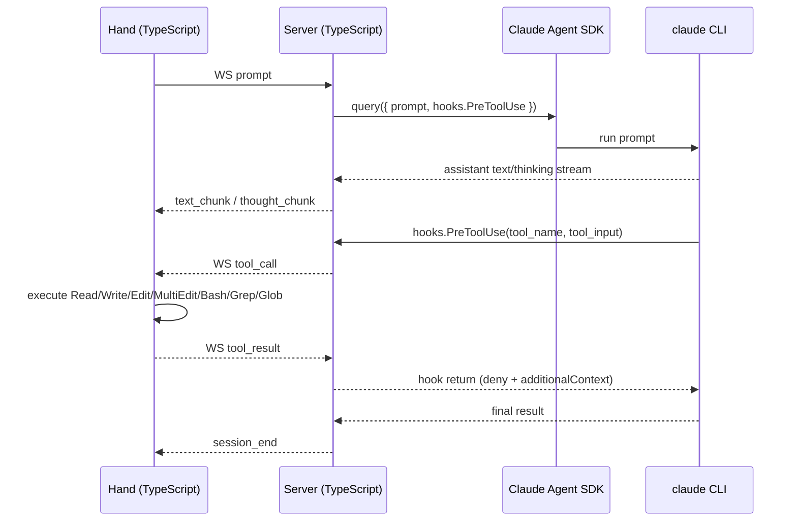

# Axon

Claude Code 的分体式架构：用户在 Hand 端交互，Hand 在本地执行工具，Server 端负责调用 Claude Agent SDK 进行推理，并通过 WebSocket 将工具调用转发回 Hand。

Split architecture for Claude Code: users interact on Hand, Hand executes tools locally, and the Server uses the Claude Agent SDK for reasoning while forwarding tool calls back to Hand over WebSocket.

## 架构总览 / Architecture Overview

```mermaid
flowchart LR
    H1[Hand CLI / TypeScript<br/>用户交互 + 工具执行]
    HN[Hand N / Future]
    S[Axon Server / TypeScript<br/>query() + hooks.PreToolUse]
    C[Claude Code CLI<br/>spawned by SDK]

    H1 <-->|WebSocket| S
    HN -. optional .-> S
    S -->|SDK query stream| C
```

当前主路径是：

The primary path today is:

```text
Hand (TypeScript) ←→ WebSocket ←→ Server (TypeScript) ←→ Claude Agent SDK query() ←→ claude CLI
```

## 概念 / Concepts

- **Hand 端 / Hand**：用户交互入口，也是 Claude 原生工具的执行环境。当前实现为 TypeScript CLI，支持 `Read`、`Write`、`Edit`、`MultiEdit`、`Bash`、`Grep`、`Glob`。
- **Server 端 / Server**：Brain 端，位于 [`server/src`](./server/src)。使用 `@anthropic-ai/claude-agent-sdk` 的 `query()` 驱动 Claude Code，并通过 `hooks.PreToolUse` 在进程内拦截工具调用。
- **通信 / Transport**：Server 与 Hand 之间通过 WebSocket 全双工通信，文本流和工具调用共用一条连接。
- **Proxy / Hook 脚本**：[`proxy/`](./proxy) 中的 Axon relay 模式已实现，但不是主路径；主路径不依赖 HTTP hookbridge、`dispatch.sh` relay 或 `settings.local.json` 注入。

## 核心时序 / Core Sequence



关键点：

Key points:

- **SDK 直接集成 / Direct SDK integration**：不再通过 ACP bridge 把工具调用转换成 client-side methods，而是直接使用 `query()` 和 `hooks.PreToolUse`。
- **进程内 Hook / In-process hooks**：工具拦截发生在 TypeScript Server 进程内，不需要额外的 HTTP bridge。
- **Hand 执行 Claude 原生工具 / Hand executes Claude-native tools**：Hand 按 Claude 工具语义执行本地操作，而不是 ACP 方法名。

## 项目结构 / Project Structure

```text
axon/
├── package.json              # npm workspaces 根配置
├── server/                   # TypeScript Axon Server（Claude Agent SDK）
│   ├── package.json
│   ├── tsconfig.json
│   └── src/
│       ├── index.ts          # Server CLI 入口，解析 --port / --model
│       ├── server.ts         # HTTP + WebSocket Server
│       ├── session.ts        # query() + hooks.PreToolUse 会话驱动
│       ├── relay.ts          # 工具调用 pending/result 管理
│       └── protocol.ts       # 消息类型定义
├── hand/                     # TypeScript Hand CLI
│   ├── package.json
│   ├── tsconfig.json
│   └── src/
│       ├── index.ts          # Hand CLI 入口
│       ├── client.ts         # WebSocket 客户端
│       ├── executor.ts       # 工具分发器
│       ├── protocol.ts       # 消息类型定义
│       ├── ui.ts             # 终端 UI
│       └── tools/
│           ├── fs.ts         # Read / Write / Edit / MultiEdit
│           ├── bash.ts       # Bash
│           └── search.ts     # Grep / Glob
└── proxy/                    # Phase 0 Hook 系统（bash，独立使用）
```

说明：

Notes:

- `server/` 与 `hand/` 是当前主实现，均为 TypeScript。
- `proxy/` 仍保留，作为独立 Hook/审计能力沉淀。

## 快速开始 / Quick Start

### 1. 安装依赖 / Install Dependencies

```bash
npm install
```

### 2. 启动 Brain Server（Docker） / Start the Brain Server (Docker)

默认不需要 `.env`。容器会：

By default, no `.env` file is required. The container will:

- 复用当前 shell / Claude Code 注入的环境变量
- 默认挂载宿主机 `~/.claude` 到容器 `/home/node/.claude`

然后直接启动：

Then start directly:

```bash
npm run brain:up
```

临时打开 debug 日志：

```bash
LOG_LEVEL=debug npm run brain:up
```

默认会把宿主机的 `~/.claude` 挂载到容器内 `/home/node/.claude`。

By default, the container bind-mounts the host `~/.claude` directory to `/home/node/.claude`.

如果你想覆盖默认挂载路径或端口，可以再创建 `.env`：

If you want to override the default mount path or ports, you can still create a `.env` file:

```bash
cp .env.example .env
```

例如在 `.env` 中加入：

For example, add this to `.env`:

```bash
CLAUDE_CONFIG_DIR=/absolute/path/to/.claude
BRAIN_HOST_PORT=8765
LOG_LEVEL=debug
LOG_JSON=false
CLAUDE_CODE_EXECUTABLE=/usr/local/bin/claude
```

例如：

For example:

```bash
CLAUDE_CONFIG_DIR=/Users/yourname/.claude
```

查看日志 / View logs:

```bash
npm run brain:logs
```

停止 / Stop:

```bash
npm run brain:down
```

前置条件 / Prerequisites：

- 已安装 Docker / Docker Compose
- 已配置 `ANTHROPIC_API_KEY`

默认情况下，Brain Server 会监听宿主机 `localhost:8765`，容器内已包含 `claude-code`。

By default, the Brain Server listens on host `localhost:8765`, and the container already includes `claude-code`.

挂载示例 / Mount examples:

```yaml
services:
  axon-brain:
    volumes:
      - ${HOME}/.claude:/home/node/.claude
      # 或者 / Or:
      # - /absolute/path/to/.claude:/home/node/.claude
```

### 3. 启动 Hand / Start the Hand

在新终端中执行：

Run in a new terminal:

```bash
cd hand && npm start -- --server localhost:8765 --cwd /path/to/project
```

这一步仍然在本机运行，因为 Hand 负责执行本地工具。

Hand still runs on the local machine because it executes local tools.

### 4. 启动 Web（可选） / Start the Web UI (Optional)

如果你要用浏览器手动测试，再开一个终端：

If you want to test from the browser, start the Web server in another terminal:

```bash
cd web && npm start -- --port 8766 --brain localhost:8765
```

打开 [http://localhost:8766](http://localhost:8766)，在设置里填：

Open [http://localhost:8766](http://localhost:8766), then fill in:

- Brain 地址 / Brain URL: `ws://localhost:8766/ws`
- 工作目录 / CWD: 你的本地项目目录
- 模型 / Model: `claude-sonnet-4-20250514`

### 5. 交互 / Interact

Hand CLI 连接成功后会自动创建 session。输入 prompt，Server 会通过 SDK 发起一次 `query()`；当 Claude 调用工具时，Hand 在本地执行并把结果回传。

After Hand connects, it creates a session automatically. Each prompt triggers one SDK `query()` call; when Claude requests a tool, Hand executes it locally and returns the result.

## 本地直跑 Server（可选） / Running Server Locally (Optional)

如果你不想用 Docker，也可以直接本地启动 Server：

If you do not want Docker, you can still start the Server locally:

```bash
cd server && npm start -- --port 8765 --model claude-sonnet-4-20250514
```

这种方式要求本机已安装并认证 `claude` CLI，且当前环境能使用 `@anthropic-ai/claude-agent-sdk`。

This mode requires a locally installed and authenticated `claude` CLI, and a working `@anthropic-ai/claude-agent-sdk` environment.

## 组件说明 / Components

### TypeScript Server

- 位于 [`server/src`](./server/src)
- 使用 `@anthropic-ai/claude-agent-sdk`
- 通过 `query()` 获取流式输出
- 通过 `hooks.PreToolUse` 拦截工具调用
- 通过 WebSocket 将 `tool_call` / `tool_result` 与 Hand 关联
- 默认监听 `/ws` 和 `/health`

### Hand CLI

- 位于 [`hand/src`](./hand/src)
- 负责终端交互、Session 驱动和本地工具执行
- 当前支持的 Claude 原生工具：
  - `Read`
  - `Write`
  - `Edit`
  - `MultiEdit`
  - `Bash`
  - `Grep`
  - `Glob`

### Proxy Hook 系统 / Proxy Hook System

- 位于 [`proxy/`](./proxy)
- 包含 Phase 0 的安全过滤与审计能力
- 独立可用，不是主路径

## 技术选择 / Technology Choices

| 组件 / Component | 当前方案 / Current Choice | 说明 / Notes |
|---|---|---|
| Brain Server | TypeScript + Node.js | 直接接入 Claude Agent SDK |
| Hand CLI | TypeScript + Node.js | 轻量 CLI，本地执行 Claude 原生工具 |
| Server ↔ Hand | WebSocket | 双向流式输出与工具回传 |
| Tool interception | `hooks.PreToolUse` | SDK 进程内回调 |
| Claude driver | `query()` | 官方 SDK 主接口 |

## Roadmap

| 阶段 / Phase | 内容 / Scope | 状态 / Status |
|---|---|---|
| Phase 0 | Proxy Hook 安全过滤系统 | ✅ 已完成 |
| Phase 1 | SDK / ACP 可行性 POC | ✅ 已完成 |
| Phase 2 | TypeScript Server + SDK hooks + TypeScript Hand | ✅ 已完成 |
| Phase 3 | Brain 容器化（Docker） | ✅ 已完成 |
| Phase 4 | Hand CLI ACP Server（编辑器集成） | ✅ 已完成 |
| Phase 5 | Hand Web（浏览器端） | ✅ 已完成 |
| Phase 6 | 生产化（TLS / 认证 / Multi-Hand） | 🚧 进行中 |

当前未完成的高优先级项：

- Web/Hand 断线后的 session 恢复，而不只是重连后新建 session
- `query()` 权限策略从 `bypassPermissions` 收敛到更细粒度的 `canUseTool`
- 指标与 tracing（Prometheus / OpenTelemetry）
- 反向代理下的 TLS / 部署示例

详细规划见 [`.claude/ROADMAP.md`](./.claude/ROADMAP.md)。

See [`.claude/ROADMAP.md`](./.claude/ROADMAP.md) for the detailed plan.

## License

MIT
