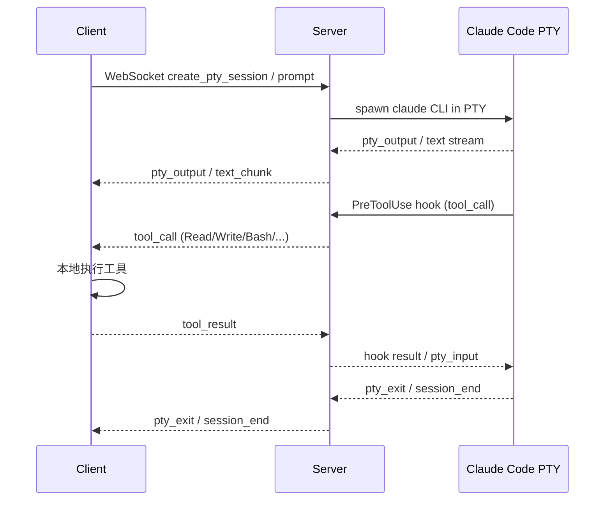

<!-- doc-init template version: v1.0 -->
# Cerelay 技术架构 / Technical Architecture

> **Owner**: 架构组
> **Reviewers**: 全员（修改架构主文档需要 ≥2 人 review）

> 本文档面向**贡献者 / 开发者**，自上而下介绍 Cerelay 的整体架构、技术选型与核心机制。用户视角的"我怎么跑起来"放在 [`../../README.md`](../../README.md)；每个核心机制的深度展开放在 [`modules/`](./modules/) 下；专题文档（容器部署 / 编辑器集成 / e2e 测试）链接在文末「关联资源」。
>
> Audience: contributors / developers. End-user "how do I run it" lives in [`../../README.md`](../../README.md); per-mechanism deep-dives live in [`modules/`](./modules/).

---

## 1. 概述 / Overview

**Cerelay**（cerebral + relay）把 Claude Code 拆成两端：

- **Server**：托管 Claude Code PTY 会话，通过 SDK / `claude` CLI 驱动推理;通过 `PreToolUse` hook 拦截工具调用、转发到 Client；为每个 session 提供独立的 mount namespace 与 FUSE 配置视图。
- **Client**：用户本机运行的 CLI / 编辑器集成；负责本地工具执行（`Read` / `Write` / `Edit` / `Bash` / `Grep` / `Glob` 等）、MCP server 代理、通过 WebSocket 把工具结果回传给 Server。
- **Web**（可选）：浏览器 UI，复用同一 WebSocket 协议。

工具调用必须在 Client 侧执行——Server 不持有用户文件系统、不直接读写用户磁盘。Server 的容器与 Client 的工作目录通过 hook + FUSE 协同得到一个**对齐的 cwd 视图**。

```text
┌──────────────────────────────────┐         ┌─────────────────────────────────────────┐
│ Client (TypeScript, 用户本机)     │         │ Server (TypeScript, 容器化)              │
│  ├─ CLI 入口 / ACP 编辑器集成      │  ws://  │  ├─ HTTP + WebSocket 服务               │
│  ├─ 工具执行(Read/Write/Bash...)  │ ───────►│  ├─ Claude Code PTY 会话托管            │
│  ├─ MCP Runtime                  │ ◄─────── │  ├─ PreToolUse hook 桥接 (tool relay)   │
│  └─ 文件代理客户端 (FUSE 写穿透)   │         │  ├─ Mount namespace + FUSE 配置投影      │
└──────────────────────────────────┘         │  └─ Shadow MCP / 容器级 SOCKS5 代理     │
                                             └─────────────────────────────────────────┘
                                                              │
                                                              ▼
                                                  ┌─────────────────────┐
                                                  │   claude CLI (PTY)  │
                                                  └─────────────────────┘
```

---

## 2. 架构图 / Architecture Diagrams

### 2.1 三层分离

```text
Client (TypeScript CLI)     Server (TypeScript + SDK)    Claude Code CLI
  ├─ Executor               ├─ Session Manager           ├─ Reasoning
  ├─ Tools                  ├─ WebSocket Router          ├─ Tool Interception
  └─ Terminal UI            ├─ MCP Proxy                 └─ Output Stream
                            └─ Mount Namespace Runtime
```

### 2.2 通信时序



### 2.3 主路径

```
Client CLI ←→ WebSocket ←→ Server ←→ SDK query() ←→ Claude Code CLI
```

---

## 3. 关键组件 / Key Components

| 组件 / Component | 位置 / Location | 职责 / Responsibility |
|---|---|---|
| **Client** | `client/src/` | CLI 入口、本地工具执行、MCP runtime、文件代理客户端、终端交互 |
| **Server** | `server/src/` | HTTP / WebSocket 服务、SDK 集成、Session 管理、MCP 代理、PTY 运行时 |
| **Web** | `web/src/` | 可选浏览器 UI（复用 WebSocket 协议） |
| **Session Runtime** | `server/src/claude-session-runtime.ts` | 为每个 session 创建隔离的 mount namespace（详见 [modules/session-runtime.md](./modules/session-runtime.md)） |
| **Tool Relay** | `server/src/session.ts` | SDK Hook 拦截 + Client 执行的工具回传管理（详见 [modules/shadow-mcp.md](./modules/shadow-mcp.md)） |
| **MCP Proxy** | `server/src/mcp-proxy.ts` | 代理 MCP Server 调用 |
| **MCP Shadow Tools** | `server/src/mcp-routed/`, `server/src/mcp-ipc-host.ts` | Plan D：用 MCP 工具替代被 disallow 的内置工具，绕开 hook deny 协议硬约束（详见 [modules/shadow-mcp.md](./modules/shadow-mcp.md)） |
| **FileAgent**（per-device 单例） | `server/src/file-agent/` | Device 级单机文件代理底座（详见 [modules/file-agent-cache.md](./modules/file-agent-cache.md)）|
| **ConfigPreloader** | `server/src/config-preloader.ts` | 启动期同步阻塞预热 home + cwd 父链 CLAUDE.md（详见 [modules/file-agent-cache.md](./modules/file-agent-cache.md)） |
| **File Proxy** | `server/src/file-proxy-manager.ts`, `client/src/file-proxy.ts` | FUSE 配置投影；与 FileAgent 共享 ClientCacheStore（详见 [modules/file-agent-cache.md](./modules/file-agent-cache.md)） |

---

## 4. 通信流 / Communication Flow

```
1. Client 发起 prompt → Server (WebSocket)
2. Server 调用 SDK query()
3. SDK 驱动 claude CLI 生成文本和工具调用
4. Server 通过 PreToolUse hook 拦截工具调用
5. Server 转发 tool_call → Client (WebSocket)
6. Client 本地执行工具
7. Client 返回 tool_result → Server (WebSocket)
8. Server 通过 hook result 反馈给 SDK
9. 循环直到 Session 结束
```

**核心不变量 / Core invariants**：

- **PTY Hook 拦截**：Server 通过 Claude Code 的 `PreToolUse` hook 接管工具调用，转发到 Client 执行
- **cwd 对齐**：CC 启动后的 `cwd` 字符串必须等于 Client 启动目录；从 CC 与 Client 两侧看，当前目录路径应一致
- **Client 文件访问**：用户文件访问必须走被 hook 拦截的工具调用（`Bash`、`Read`、`Write`、`Edit`、`MultiEdit`、`Grep`、`Glob`），并在 Client 本机执行；不要通过 FUSE 把项目目录或 Client 根目录映射给 CC
- **FUSE 范围**：FUSE file proxy 只允许 Claude 配置范围（`~/.claude/`、`~/.claude.json`、`{cwd}/.claude/`）；项目源码、cwd 上级目录、系统其他路径的访问能力来自 Client-routed tools
- **凭证 shadow**：Server 侧凭证作为 `home-claude/.credentials.json` shadow file 暴露给 runtime，读写、truncate 都作用在 Server 侧本地凭证文件

---

## 5. 技术选型 / Technology Choices

| 决策点 | 选择 | 理由 |
|---|---|---|
| Server 框架 | TypeScript + Node.js | 直接集成 Claude Agent SDK |
| 通信协议 | WebSocket | 双向流式传输，长连接低延迟 |
| Tool Interception | SDK `PreToolUse` Hook | 官方 SDK 标准机制 |
| Runtime Isolation | Mount Namespace（`unshare` / `nsenter`） | Docker 内的隔离进程命名空间，无需启动新容器 |
| Session Management | Per-session Runtime | 每个 Session 独立 Claude 运行环境，避免状态污染 |
| Client CLI Framework | Commander.js | 轻量级命令行解析 |
| 包管理 | npm workspaces | 单仓库多 workspace（server / client / web） |
| 测试运行器 | Node.js 原生 `node --test` | 零额外依赖、ESM 友好 |
| FUSE | 自实现 file proxy daemon | 精确控制可见路径范围（不依赖系统 fuse mount） |
| 缓存 | 内容寻址 blob + manifest | 天然去重；按 deviceId 分桶（device-only，跨 cwd 共享） |

---

## 6. 核心机制模块地图 / Core Mechanisms Module Map

每个核心机制独立成一份模块文档；本节只给提要 + 链接，详情进模块文档。

| 模块 | 文档 | 提要 |
|---|---|---|
| Mount Namespace 隔离 | [modules/session-runtime.md](./modules/session-runtime.md) | 为每个 session 创建独立 mount namespace；CC 看到的 HOME / cwd 对齐 Client；`unshare` / `nsenter` 实现 |
| SDK Hook 拦截 + Shadow MCP (Plan D) | [modules/shadow-mcp.md](./modules/shadow-mcp.md) | `PreToolUse` hook 工具转发；Plan D 用 inline MCP 替代被 disallow 的内置工具，绕开 hook deny 必然 `is_error: true` 的协议硬约束 |
| PTY / Shell 支持 | [modules/pty-session.md](./modules/pty-session.md) | 为交互式命令提供 PTY；host script 与 Client 协同 |
| FileAgent + ConfigPreloader + FUSE cache | [modules/file-agent-cache.md](./modules/file-agent-cache.md) | per-device 单机文件代理底座；启动期同步预热；FUSE 读路径与 cache 协同 |
| 启动期进度 UI（Phase 抽象） | [modules/startup-progress-ui.md](./modules/startup-progress-ui.md) | cache sync 扫描 / 上传 + PTY 启动 3 个 phase 统一走 Phase 抽象；项目级强制约束 |
| 容器级 SOCKS5 代理 | [modules/socks5-proxy.md](./modules/socks5-proxy.md) | sing-box TUN + `nftables`，fail-closed；容器级而非 session 级 |
| ACP 编辑器集成 | [modules/acp-editor-integration.md](./modules/acp-editor-integration.md) | `cerelay acp` stdio JSON-RPC 与编辑器（Zed / VS Code）通信 |

---

## 7. 项目结构 / Project Structure

```text
cerelay/
├── server/                          # Server（Claude Agent SDK 托管）
│   ├── src/
│   │   ├── index.ts                 # CLI 入口
│   │   ├── server.ts                # HTTP + WebSocket 服务
│   │   ├── session.ts               # query() 会话驱动 + 工具 relay
│   │   ├── claude-session-runtime.ts# 隔离运行时（mount namespace）
│   │   ├── claude-hook-injection.ts # SDK Hook 注入
│   │   ├── pty-session.ts           # PTY/Shell 会话管理
│   │   ├── mcp-proxy.ts             # MCP Server 代理
│   │   ├── mcp-routed/              # Plan D: shadow MCP server
│   │   ├── mcp-ipc-host.ts          # Plan D: per-session unix socket host
│   │   ├── mcp-cc-injection.ts      # Plan D: CC CLI flag 注入
│   │   ├── file-agent/              # FileAgent 底座（per-device 单例）
│   │   ├── config-preloader.ts      # 启动期同步预热模块
│   │   ├── file-proxy-manager.ts    # FUSE 配置投影 daemon
│   │   ├── protocol.ts              # 消息类型定义
│   │   └── logger.ts
│   └── test/
├── client/                          # Client（用户交互 + 工具执行）
│   ├── src/
│   │   ├── index.ts                 # CLI 入口
│   │   ├── client.ts                # WebSocket 客户端
│   │   ├── executor.ts              # 工具分发器
│   │   ├── ui.ts                    # 启动期进度 UI（Phase 抽象）
│   │   ├── cache-sync.ts            # 启动期增量缓存同步
│   │   ├── cache-task-state-machine.ts
│   │   ├── tools/                   # Read / Write / Edit / Bash / Grep / Glob
│   │   ├── mcp/runtime.ts           # MCP Runtime 桥接
│   │   ├── file-proxy.ts            # 文件代理客户端
│   │   └── ...
│   └── test/
├── web/                             # 浏览器 UI（可选）
├── docs/                            # 技术文档（本目录所在层）
├── docker-compose.yml
├── Dockerfile
└── docker-entrypoint.sh
```

详细 src 文件清单见各模块文档。

---

## 8. 系统级环境变量 / System-level Environment Variables

> 用户使用相关的环境变量（如 `CERELAY_KEY`、`HTTP_PROXY`、`NO_PROXY`）见 [`../../README.md`](../../README.md)。本节列举只有部署 / 调试 / 二次开发会用到的内部变量。

| 变量 | 默认值 | 说明 |
|---|---|---|
| `CERELAY_ENABLE_MOUNT_NAMESPACE` | `true` | 是否启用 mount namespace 隔离 |
| `CERELAY_ENABLE_SHADOW_MCP` | `true` | Plan D shadow MCP 总开关；显式 `false`/`0`/`no`/`off` 关闭后走 legacy hook 路径 |
| `CERELAY_SHADOW_MCP_SOCKET_DIR` | `${CERELAY_DATA_DIR}/sockets/` | shadow MCP unix socket 父目录 |
| `CERELAY_DATA_DIR` | `/var/lib/cerelay` | 容器内持久化数据目录（凭证 + Client 缓存 + sockets） |
| `CERELAY_DISABLE_INITIAL_CACHE_SYNC` | — | 测试用：跳过启动期缓存同步流程 |
| `CERELAY_SOCKS_DNS_SERVER` | `1.1.1.1` | TUN 模式下走代理解析的上游 DNS |
| `CERELAY_SOCKS_UDP` | `forward` | UDP 策略：`forward` 继续放行，`block` 显式拒绝非 DNS UDP |
| `CERELAY_SOCKS_TUN_ADDRESS` | `172.19.0.1/30` | sing-box TUN 地址段 |
| `CERELAY_SOCKS_TUN_MTU` | `9000` | sing-box TUN MTU |
| `LOG_LEVEL` | `info` | 日志级别（debug/info/warn/error） |
| `LOG_JSON` | — | 是否输出 JSON Lines 日志 |

---

## 9. 测试架构 / Testing Architecture

### 9.1 单元测试

- 位置：`**/test/*.test.ts`
- 运行：`npm test` 或 `npm run test:workspaces`
- 使用 Node.js 原生 `node --test` 运行器

### 9.2 E2E 集成测试

**单模块 / 协议层 e2e**（server-only，import 内部模块 + 注入 fixture）：
- `server/test/e2e-real-claude-bash.test.ts`、`server/test/e2e-mcp-shadow-bash.test.ts`、`server/test/e2e-pty.test.ts`、`server/test/e2e-cross-cwd-and-mutations.test.ts`、`server/test/e2e-file-agent.test.ts`、`server/test/e2e-daemon-no-perforation.test.ts`、`server/test/e2e-runtime-negative-persisted.test.ts`
- **Plan D 双路径不变量**：`mcp__cerelay__*` 路径 `is_error === false`；legacy hook 路径 `is_error === true`（CC 协议硬约束）

**全链路综合 e2e**（多容器：真 server + N 真 client + mock anthropic + orchestrator）：
- 详见 [`../testing/e2e-comprehensive-testing.md`](../testing/e2e-comprehensive-testing.md)
- 默认在 `npm test` 中容器化跑，覆盖工具链路、文件代理、cache 同步、mount namespace、redaction、多 device / 多 client 拓扑
- 三阶段推进 P0 → P1 → P2，**每次功能变更必须同步审计覆盖矩阵**（约束写在 [`../../CLAUDE.md`](../../CLAUDE.md)）

### 9.3 烟测

```bash
npm run test:smoke
```

验证基础功能（build、typecheck、Docker entrypoint）。

### 9.4 并发约束

测试使用 `--test-concurrency=1` 防止并发干扰（PTY、unix socket、FUSE 等资源容易踩踏）。

---

## 10. 性能考虑 / Performance Considerations

1. **Session 隔离**：每个 Session 有独立的 Claude 运行时，避免状态污染
2. **流式传输**：WebSocket 流式传输文本和工具调用结果，避免大批量缓冲
3. **Cache 启动期 pipeline**：多个文件并行 in-flight，`MAX_INFLIGHT_BYTES = 16 MB` 流控；本地 / 局域网下基本不触发上限
4. **并发控制**：测试使用 `--test-concurrency=1` 防止资源竞争

---

## 关联资源 / Related Resources

- 测试：[`../testing/e2e-comprehensive-testing.md`](../testing/e2e-comprehensive-testing.md)
- 容器部署：[`../operations/brain-docker.md`](../operations/brain-docker.md)
- 项目宪法：[`../overview/constitution.md`](../overview/constitution.md)
- 文档规约：[`../AGENTS.md`](../AGENTS.md)
- 决策记录：[`../decisions/`](../decisions/)
- Capability spec：[`../specs/`](../specs/)
- 项目 worldview：[`../overview/project.md`](../overview/project.md)
- AI 协作规范：[`../../CLAUDE.md`](../../CLAUDE.md)
- Superpowers specs：[`../archive/2026-05-01-access-ledger-driven-cache/design.md`](../archive/2026-05-01-access-ledger-driven-cache/design.md)
