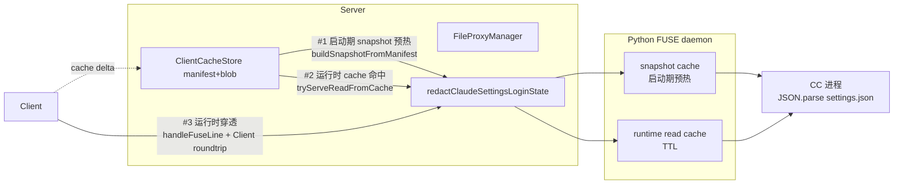

# Shadow `~/.claude/settings.json` 登录态字段设计 / Shadow Login-State Fields in `~/.claude/settings.json`

**日期 / Date**：2026-04-30
**作者 / Author**：Claude × User 共创 / Co-designed
**状态 / Status**：方案已对齐，待实施 / Design approved, pending implementation

---

## 1. 概述 / Overview

### 中文

cerelay PTY session 启动时，CC（Claude Code）在 mount namespace 内看到的 `~/.claude/settings.json` 当前直接来自 Client 端 cache 同步。该文件中的若干字段（`env.ANTHROPIC_BASE_URL` / `env.ANTHROPIC_API_KEY` / `env.ANTHROPIC_AUTH_TOKEN` / 顶层 `apiKeyHelper`）属于"登录态"——会让 CC 用 Client 端配置的 endpoint 与 API key 认证。这违反 cerelay 的核心隔离约束：**Client 不应该影响 Server 侧的认证身份**。

本设计在 server 端 FUSE 出口加一层"字段级 redaction"，所有从 server 流向 CC namespace 的 `~/.claude/settings.json` 内容强制经过 JSON 过滤——删除上述 4 个字段，并用尾部空格补齐到原 size，使 stat 完全无需联动改动。

### English

When a cerelay PTY session boots, the `~/.claude/settings.json` that CC sees inside its mount namespace comes verbatim from Client cache sync. Several fields in that file (`env.ANTHROPIC_BASE_URL` / `env.ANTHROPIC_API_KEY` / `env.ANTHROPIC_AUTH_TOKEN` / top-level `apiKeyHelper`) constitute *login state*: they make CC authenticate using the Client-side endpoint and API key. This violates cerelay's core isolation invariant: **the Client must not influence Server-side authentication identity**.

This design adds a server-side field-level redaction filter at the FUSE egress: every `~/.claude/settings.json` byte stream flowing from server toward CC namespace is JSON-filtered, the 4 fields above are deleted, and trailing whitespace pads the result back to the original byte length so that the `stat` path needs no changes.

---

## 2. 背景与问题 / Background and Problem

### 现状 / Current State

cerelay 的 PTY session 文件层组成：

```
namespace 内 CC 看到的视图
├── ~/.claude/.credentials.json   ← server-side shadow file（FUSE → Data 目录持久化）
├── ~/.claude/settings.json       ← Client cache 直接镜像（含登录态字段，问题所在）
├── ~/.claude/...其它             ← Client cache 直接镜像
├── ~/.claude.json                ← Client cache 直接镜像
└── {cwd}/.claude/settings.local.json ← server-side shadow file（hook injection）
```

Client 端 `~/.claude/settings.json` 完整原文经 cache 同步后落到 server 的 `client-cache/<deviceId>/<cwdHash>/blobs/<sha256>`，FUSE daemon 启动时把内容预热进 Python 端缓存，CC 读时拿到的就是 Client 原文。

### 问题 / Problem

CC 解析 `~/.claude/settings.json` 时会用其中的 `env.*` 覆盖进程环境变量、用 `apiKeyHelper` 触发外部脚本拿 API key。Client 端用户配置（个人 base URL、企业代理、外部 API key helper）由此泄漏到 server 侧 CC 进程，覆盖 server 通过 docker `.env` 或 OAuth credentials 注入的认证身份。

### 边界情况 / Edge Case

- Client 在 cerelay session 运行**期间**修改 `~/.claude/settings.json`：cache_watcher 会推送 `cache_task_delta`，server 的 cache blob 更新到最新 Client 原文。
- **要求**：CC 在新一轮 read 时**仍然只看到过滤后的版本**。redaction 必须在 server → CC 的最后一公里执行，**不能依赖 cache 同步链路上任何中间环节的清洁性**。

---

## 3. 目标 / Goals

- `~/.claude/settings.json` 中以下 4 个字段在 CC namespace 内**永远不可见**：
  - `env.ANTHROPIC_BASE_URL`
  - `env.ANTHROPIC_API_KEY`
  - `env.ANTHROPIC_AUTH_TOKEN`
  - 顶层 `apiKeyHelper`
- Client 端可以正常修改 `~/.claude/settings.json`（含上述字段），cache 同步可以正常推送；server 侧的 cache blob 保留 Client 原文不变。
- 过滤命中（原文含至少一个登录态字段）时，输出 size 与原 size byte-equal——`stat` 路径完全不用改。
- 过滤未命中（原文无登录态字段）时，byte-equal 原文，无任何漂移。

## 4. 非目标 / Non-Goals

- **不处理 `~/.claude.json`（home-claude-json scope）中的同类登录态字段**。CC 历史版本与企业部署中可能把 `apiKeyHelper`、`oauthAccount` 等放到这里，本次范围明确不覆盖。后续如发现实际泄漏再扩展。详见第 9 节"未尽事项"。
- 不在 Client 端做过滤——若仅靠 Client 漏 patch 即破防，违反"server 不信任 Client"原则。
- 不改 cache 同步协议（`CacheTaskDelta` / `CacheManifest` 格式不变）。
- 不为 settings.json 单独建 server-side shadow file——shadow 是"server 占用、Client 不可见"的语义，跟字段级 override 不匹配，且会让 Client 端的非登录态偏好（theme / statusLine / hooks 等）在 cerelay session 里失效。

---

## 5. 架构设计 / Architecture

### 5.1 出口模型 / Egress Model

server 给 CC namespace 提供 `~/.claude/settings.json` 内容有三条出口路径，**redaction 必须在三处全部生效**：



| # | 出口 | 触发场景 | 改造点 |
|---|------|---------|-------|
| 1 | 启动期 snapshot 预热 | FUSE daemon 启动时把 manifest 中的 settings.json 灌进 Python 本地缓存 | `file-proxy-manager.ts: buildSnapshotFromManifest` 对 settings.json 条目用过滤后的 buffer 重算 `data` |
| 2 | 运行时 cache 命中 | `tryServeReadFromCache` 命中 settings.json 的 blob 后直接回 FUSE daemon | 命中后过滤 buf 再做 `offset`/`size` 切片 |
| 3 | 运行时 Client 穿透 | cache miss / mutation hint bypass / cache 未启用 | `handleFuseLine` 检测 settings.json read 进入专用分支 `handleSettingsJsonReadPassthrough`：先拉全文（`getattr` + 全文 `read` 两次 round-trip，cache 中有 manifest 时跳过 stat）→ size-preserving redact → 按原始 `(offset, size)` 切片回 Python。不经 `resolveResponse`。 |

### 5.2 Size-preserving redaction

```text
原文 N 字节                                 过滤后输出 N 字节
┌────────────────────────────┐              ┌─────────────────────┬─────┐
│ {                          │              │ {                   │     │
│   "env": {                 │              │   "env": {          │     │
│     "ANTHROPIC_BASE_URL":  │   redact     │   },                │     │
│       "https://..."        │   ───────►   │   "theme": "dark"   │ ' ' │
│   },                       │              │ }                   │ ... │
│   "theme": "dark"          │              │                     │     │
│ }                          │              │                     │     │
└────────────────────────────┘              └─────────────────────┴─────┘
                                            ↑ JSON.stringify(obj)        ↑ trailing
                                              minified                     padding
```

JSON 规范允许 `{...}` 后跟任意空白字符，所有合规 `JSON.parse` 实现（含 V8 / CC 内部解析器）都接受。

### 5.3 同步路径不变量 / Sync-Path Invariant

```
[Client 修改 ~/.claude/settings.json]
       │
       ▼
[Client cache_watcher 检测到 mtime/sha 变化]
       │ cache_task_delta（含原文 base64）
       ▼
[Server applyDelta：写 blob、更新 manifest]    ← 原文落盘，不过滤（保持 cache 同步语义）
       │
       ▼
[CC 在 namespace 内下次 read settings.json]
       │
       ├─ Python FUSE 本地 read cache 在 TTL 内 → 拿旧值（已过滤）✓
       └─ TTL 失效 → 走 server tryServeReadFromCache → redact → 回 Python ✓
```

**关键**：server 的 cache blob 永远是 Client 原文（保持 cache 协议中立、不污染未来双向同步），过滤只发生在 server → CC namespace 的最后一公里。Client 端 settings.json 怎么改、怎么同步，CC 端永远只能看到过滤后的版本。

---

## 6. 实现细节 / Implementation Details

### 6.1 过滤函数 / Filter Function

新文件：`server/src/claude-settings-redaction.ts`

```ts
/**
 * 删除 ~/.claude/settings.json 中的登录态字段，并用尾部空格补齐到原 size。
 *
 * 删除范围：
 *   - obj.env.ANTHROPIC_BASE_URL
 *   - obj.env.ANTHROPIC_API_KEY
 *   - obj.env.ANTHROPIC_AUTH_TOKEN
 *   - obj.apiKeyHelper
 *
 * 设计要点：
 *   - 非法 JSON：原样返回（CC 自己也读不了非法 JSON，影响零）
 *   - 原文无登录态字段：byte-equal 返回，避免重新序列化引入字段顺序/缩进漂移
 *   - 命中：JSON.stringify minify + trailing whitespace 补齐 size，让 stat 路径无需改动
 *
 * 未尽事项（不在本次范围）：
 *   ~/.claude.json 也可能含 apiKeyHelper / oauthAccount 等登录态字段，
 *   本函数只负责 ~/.claude/settings.json，不处理 ~/.claude.json。
 *   后续若发现 .claude.json 路径也有泄漏再扩展。
 */
export function redactClaudeSettingsLoginState(buf: Buffer): Buffer;

/** 仅判断 scope+relPath 是否需要过滤 */
export function isClaudeHomeSettingsJson(
  scope: CacheScope,
  relPath: string,
): boolean;
```

实现伪码：

```ts
function redactClaudeSettingsLoginState(buf: Buffer): Buffer {
  let obj: any;
  try {
    obj = JSON.parse(buf.toString("utf8"));
  } catch {
    return buf;
  }
  if (!obj || typeof obj !== "object" || Array.isArray(obj)) return buf;

  const hasField =
    (obj.env && typeof obj.env === "object" && (
      "ANTHROPIC_BASE_URL" in obj.env ||
      "ANTHROPIC_API_KEY" in obj.env ||
      "ANTHROPIC_AUTH_TOKEN" in obj.env
    )) ||
    "apiKeyHelper" in obj;
  if (!hasField) return buf;

  if (obj.env && typeof obj.env === "object") {
    delete obj.env.ANTHROPIC_BASE_URL;
    delete obj.env.ANTHROPIC_API_KEY;
    delete obj.env.ANTHROPIC_AUTH_TOKEN;
  }
  delete obj.apiKeyHelper;

  const minified = Buffer.from(JSON.stringify(obj), "utf8");
  const diff = buf.byteLength - minified.byteLength;
  if (diff < 0) return minified;       // 理论不可能（只删不加），兜底
  if (diff === 0) return minified;
  return Buffer.concat([minified, Buffer.alloc(diff, 0x20)]);
}

function isClaudeHomeSettingsJson(scope: CacheScope, relPath: string): boolean {
  return scope === "claude-home" && relPath === "settings.json";
}
```

### 6.2 三处出口改造 / Three Egress Points

#### 出口 #1：启动期 snapshot 预热

**文件**：`server/src/file-proxy-manager.ts`，方法 `cacheEntryToSnapshot` 与 `buildSnapshotFromManifest`

```ts
private cacheEntryToSnapshot(
  absPath: string,
  entry: CacheEntry,
  scope: CacheScope,
  relPath: string,
): FileProxySnapshotEntry {
  let data: string | undefined;
  if (!entry.skipped && entry.sha256 && this.cacheAvailable()) {
    const buf = this.cacheStore!.readBlobSync(this.deviceId!, this.clientCwd, entry.sha256);
    if (buf) {
      // 出口 #1：settings.json 灌入 Python 缓存前 redact
      const out = isClaudeHomeSettingsJson(scope, relPath)
        ? redactClaudeSettingsLoginState(buf)
        : buf;
      data = out.toString("base64");
    }
  }
  return {
    path: absPath,
    stat: makeFileStat(entry.size, entry.mtime),  // size 不变（原 entry.size）
    data,
  };
}
```

#### 出口 #2：运行时 cache 命中

**文件**：`server/src/file-proxy-manager.ts`，方法 `tryServeReadFromCache`

```ts
private async tryServeReadFromCache(req: FuseRequest): Promise<boolean> {
  // ... 现有 lookup 与 entry 检查不变 ...

  let buf = this.cacheStore.readBlobSync(...);
  if (!buf) return false;

  // 出口 #2：settings.json 在切片前 redact
  if (isClaudeHomeSettingsJson(scope, cacheRelPath)) {
    buf = redactClaudeSettingsLoginState(buf);
  }

  const offset = req.offset ?? 0;
  const size = req.size ?? buf.byteLength;
  const slice = buf.subarray(offset, Math.min(offset + size, buf.byteLength));
  this.writeToDaemon({ reqId: req.reqId, data: slice.toString("base64") });
  return true;
}
```

#### 出口 #3：运行时 Client 穿透

**文件**：`server/src/file-proxy-manager.ts`，方法 `handleFuseLine`

settings.json 的 read 走专用分支：拉全文 → redact → 本地切片，**不复用通用 deferred 链路**（避免在 `resolveResponse` 里强行重新 dispatch）。专用分支既不影响通用路径，又能集中处理 stat→read 两次 round-trip 与切片逻辑。

```ts
private async handleFuseLine(line: string): Promise<void> {
  const req: FuseRequest = JSON.parse(line);
  const { root, relPath, reqId } = req;
  // ... 现有 root 解析、cache 优先 read 不变 ...

  // 出口 #3：settings.json read 专用分支
  const scope = rootToCacheScope(root);
  const cacheRelPath = scope ? toCacheRelPath(scope, relPath) : "";
  if (
    req.op === "read" &&
    scope &&
    isClaudeHomeSettingsJson(scope, cacheRelPath)
  ) {
    await this.handleSettingsJsonReadPassthrough(req, root);
    return;
  }

  // ... 其余通用透传逻辑不变 ...
}

/** 专用分支：拉全文 → redact → 切片 */
private async handleSettingsJsonReadPassthrough(
  req: FuseRequest,
  root: string,
): Promise<void> {
  const clientRoot = this.roots[root];
  const clientPath = req.relPath ? path.join(clientRoot, req.relPath) : clientRoot;
  const offsetOrig = req.offset ?? 0;
  const sizeOrig = req.size ?? 0;

  try {
    // 1. 拉全文 size：优先看 cache manifest（无额外 round-trip）；不可用时 stat
    let fullSize = await this.tryGetSettingsJsonSizeFromCache();
    if (fullSize === null) {
      const statResp = await this.sendClientRequest({
        op: "getattr", path: clientPath,
      });
      fullSize = (statResp.stat as FileProxyStat | undefined)?.size ?? 0;
    }
    if (fullSize === 0) {
      this.writeToDaemon({ reqId: req.reqId, data: "" });
      return;
    }

    // 2. 拉全文内容
    const readResp = await this.sendClientRequest({
      op: "read", path: clientPath, offset: 0, size: fullSize,
    });
    const fullBuf = Buffer.from((readResp.data as string) ?? "", "base64");

    // 3. redact（size-preserving，输出仍然是 fullSize 字节）
    const redacted = redactClaudeSettingsLoginState(fullBuf);

    // 4. 按 Python 原始 (offsetOrig, sizeOrig) 切片
    const slice = redacted.subarray(
      offsetOrig,
      Math.min(offsetOrig + sizeOrig, redacted.byteLength),
    );

    this.writeToDaemon({ reqId: req.reqId, data: slice.toString("base64") });
  } catch (err) {
    this.writeToDaemon({
      reqId: req.reqId,
      error: { code: 5, message: `EIO: settings.json passthrough failed: ${err}` },
    });
  }
}
```

辅助方法：

- `sendClientRequest(partial)`：抽出已有 `handleFuseLine` 中"注册 deferred + sendToClient + 等响应"的逻辑，复用同一个 pending registry，但把响应作为 raw FileProxyResponse 返回给调用方（不写回 Python）
- `tryGetSettingsJsonSizeFromCache()`：从 `cacheStore.lookupEntry("claude-home", "settings.json")` 拿 `entry.size`；entry 不存在 / cache 未启用时返回 null

**`Deferred` 不需要新增 meta 字段**——专用分支自己消费响应，不经过 `resolveResponse`。通用 read 路径继续走原有 `resolveResponse`，对其它非 settings.json 文件无影响。

**为什么必须 server 侧拉全文（设计依据）**

经验证（`client/src/file-proxy.ts:238-251 doRead` 与 Python `server/src/fuse-host-script.ts:429-436 read`）：

- Python FUSE `read(path, size, offset)` 直接把 `(offset, size)` 转发给 server
- 通用 server 透传路径在 `handleFuseLine` 里把 `(offset, size)` 透传给 Client
- Client `doRead(filePath, offset, size)` 严格按 `(offset, size)` 切片返回（`Buffer.alloc(size).read(..., offset)`）

→ 如果 server 直接 redact Client 返回的切片，**只看到原文的一段，无法判断哪些字节属于登录态字段**。size-preserving 的前提（看到完整文件）被破坏。

→ 故 settings.json read 必须走专用分支，由 server 主动拉全文、本地 redact、本地切片，再回 Python。

成本：出口 #3 settings.json read 在 cache manifest 不可用的情况下多一次 stat round-trip。该路径仅在 cache miss / mutation hint bypass / cache 未启用 时触发，且 Python FUSE 端有 read TTL 缓存吸收热点请求，实际频率很低，可接受。

### 6.3 文件位置表 / File Locations

| 文件 / File | 修改类型 / Change | 修改要点 / Key Points |
|---|---|---|
| `server/src/claude-settings-redaction.ts` | 新建 / New | `redactClaudeSettingsLoginState` + `isClaudeHomeSettingsJson` |
| `server/src/file-proxy-manager.ts` | 修改 / Modify | 出口 #1 / #2 在原有路径插入过滤；新增 `handleSettingsJsonReadPassthrough` 专用分支处理出口 #3；新增 `sendClientRequest` 辅助方法（复用 pending registry 机制但返回 raw response 给调用方） |
| `server/test/claude-settings-redaction.test.ts` | 新建 / New | 单元测试见第 7 节 |
| `server/test/file-proxy-manager-redaction.test.ts` | 新建 / New | 集成测试：三处出口都过滤 |
| `server/src/CLAUDE.md` 或注释 | 文档同步 / Docs | 注明 `~/.claude.json` 暂不过滤、未尽事项见 spec |
| `CLAUDE.md`（项目根） | 文档同步 / Docs | "Filesystem access invariants" 段落补充 settings.json redaction 的不变量 |

---

## 7. 测试验证 / Testing

### 7.1 单元测试 / Unit Tests

`server/test/claude-settings-redaction.test.ts`：

| 用例 / Case | 输入 / Input | 期望 / Expected |
|---|---|---|
| 非法 JSON 原样返回 | `not-json` | byte-equal 输入 |
| 无登录态字段 byte-equal | `{"theme":"dark"}` | byte-equal 输入（不重新 stringify） |
| `env.ANTHROPIC_BASE_URL` 命中 | 含此字段 | 删除该 key、env 其他字段保留、size 与原始 byte 数相同、JSON.parse 成功且无该字段 |
| 同时命中 4 个字段 | 全部 4 个字段 | 4 个全删、其它字段（theme、statusLine、hooks 等）保留、size 一致 |
| `apiKeyHelper` 命中、env 不存在 | `{"apiKeyHelper":"/usr/bin/get-key"}` | apiKeyHelper 删除、size 一致 |
| `env` 删空后保留空对象 | 仅有 ANTHROPIC_API_KEY 一个字段 | 输出含 `"env":{}`，不抛错 |
| 数组 / 标量根 | `[1,2,3]`、`"foo"` | 原样返回（防御非对象根） |
| 嵌套对象不穿透 | `env.foo.ANTHROPIC_API_KEY` | 不删除（只删 top-level env 的目标 key） |
| trailing whitespace 后 JSON.parse 工作 | 命中后输出 | `JSON.parse(output)` 成功且无登录态字段 |
| size diff = 0 边界 | 删除后正好等长（虚构构造） | 不挂任何 padding，输出与 minified 一致 |

`isClaudeHomeSettingsJson`：

| scope | relPath | 期望 |
|---|---|---|
| `claude-home` | `settings.json` | true |
| `claude-home` | `settings.local.json` | false |
| `claude-home` | `subdir/settings.json` | false |
| `claude-json` | `""` | false |

### 7.2 集成测试 / Integration Tests

`server/test/file-proxy-manager-redaction.test.ts`：

1. **出口 #1**：构造 manifest 含 settings.json with login fields → 调 `buildSnapshotFromManifest` → 检查 snapshot entry 中 `data` 解码后 byte-equal 过滤后版本 + size 等于原 size
2. **出口 #2**：mock `cacheStore.readBlobSync` 返回含 login fields 的 buf → 触发 `tryServeReadFromCache` → 检查写入 Python 的 `data` 是过滤版
3. **出口 #3**：mock Client，对 settings.json 的 read 请求（带任意 offset/size）→ 验证 server 改写为 `getattr` + 全文 `read` 两次 round-trip → 收到含 login fields 的全文 base64 → 检查写回 Python 的 slice 是过滤后字节、长度等于原始请求 size、offset 对齐
4. **出口 #3 cache size shortcut**：cacheStore 中已有 settings.json 的 manifest entry → 验证不发 `getattr`，直接用 entry.size 跳到 read
5. **非 settings.json 不动**：同样路径但 `relPath` 是 `settings.local.json` 或其他 → 数据 byte-equal 原文，且 `handleFuseLine` 走通用透传分支（不进 settings.json 专用分支）
6. **同步循环**：模拟 cache delta 更新 settings.json 内容（含 login fields） → 下次 `tryServeReadFromCache` 仍然过滤 → 验证 invariant

### 7.3 E2E（可选）/ E2E (Optional)

如果时间允许，加一条 e2e：用 mock Client 注入一个含登录态字段的 settings.json，启动真实 PTY session，用 mcp__cerelay__read 工具读出来，断言 4 个字段都不在结果中。

---

## 8. 已知 trade-offs / Known Trade-offs

| Trade-off | 说明 / Notes |
|---|---|
| 命中过滤时输出是 minified JSON | CC 不依赖 settings.json 的具体格式（pretty-print / 缩进），只 parse 后取字段。trailing whitespace 在 V8 `JSON.parse` 下合规。 |
| 字段顺序按 V8 default | `JSON.stringify` 按对象插入顺序；CC 不依赖字段顺序。 |
| Python FUSE 本地 read cache TTL 内可能短暂返回旧值 | 旧值也已是过滤版（启动期 snapshot 预热已 redact），不存在"未过滤泄漏"窗口。Client 改完后的最新内容会在 TTL 失效后体现。 |
| 命中 redact 时 stat 不需要改 | size-preserving padding 保证；非命中（无登录态字段）时 byte-equal 原文，更不需要改。 |

---

## 9. 未尽事项 / Open Items

### 9.1 `~/.claude.json` (home-claude-json scope) 同类登录态字段

**本次明确不处理**。CC 历史版本与企业部署中可能把以下字段放到 `~/.claude.json`：

- `apiKeyHelper`
- `oauthAccount`
- `env.*`（部分版本）
- 其它认证/账号 metadata

后续若发现实际泄漏（例如：用户报"我在 .claude.json 里设的 apiKeyHelper 居然在 cerelay 里被调用了"），扩展方案：
1. `redactClaudeJsonLoginState` 复用相同 size-preserving 思路
2. `isClaudeHomeSettingsJson` 旁边增加 `isClaudeHomeJson(scope, relPath)`（`scope === "claude-json" && relPath === ""`）
3. 三处出口分别增加判断

代码注释中已明确标注此 TODO，避免后续遗忘。

### 9.2 stat 透传路径如果未来需要精确 size

当前 stat 不动，依赖 size-preserving padding 让原 size 与 redacted size 一致。如果未来 redaction 范围扩大到不能 size-preserving 的字段（例如必须把整行删掉而无法用 whitespace 代替），需要在 stat 透传路径也插过滤、动态重算 size。

---

## 10. 相关 Commit / Related Commits

待实施后回填 / To be filled after implementation。

---

## 11. 变更历史 / Change Log

| 日期 / Date | 变更 / Change | 备注 / Notes |
|---|---|---|
| 2026-04-30 | 初稿 / Initial draft | Claude × User 共创 |
